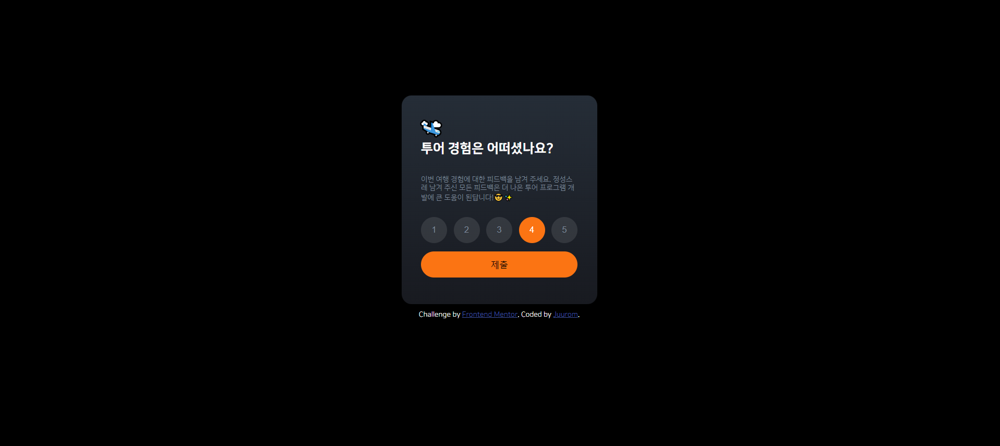
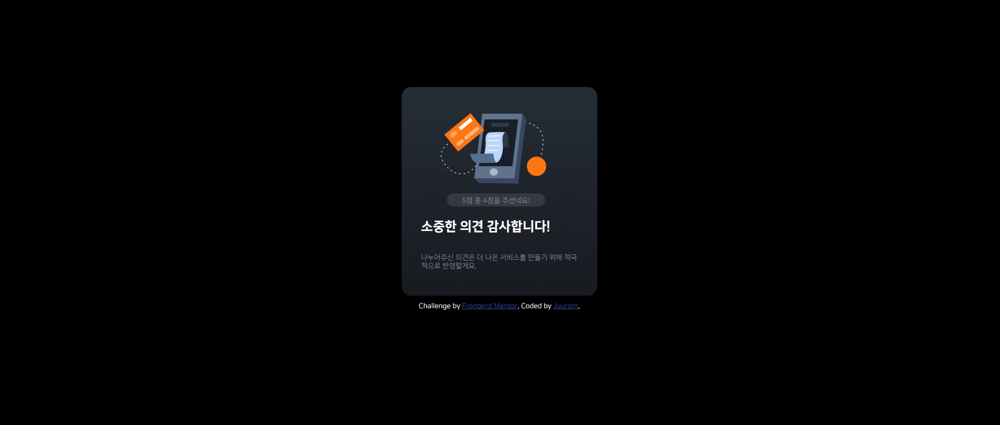

# Frontend Mentor - Interactive rating component solution

이 솔루션은 [Interactive rating component challenge on Frontend Mentor](https://www.frontendmentor.io/challenges/interactive-rating-component-koxpeBUmI). 챌린지 참여 결과물입니다.

## 차례

- [소개](#소개)
  - [챌린지](#챌린지)
  - [화면 스크린샷](#화면-스크린샷)
  - [링크](#링크)
- [배운 점](#배운-점)
  - [사용 tool](#사용-tool)
  - [새롭게 배운 것](#새롭게-배운-것)
  - [앞으로 배울 것](#앞으로-배울-것)
  - [참고 사이트](#참고-사이트)
- [제작자](#제작자)
- [기타사항](#기타사항)

## 소개

### 챌린지

사용자 별점 피드백 입력 방법을 구현했다.
마우스 커서를 올리거나 클릭했을 때 색상으로 구분 가능하도록 만들었다.
피드백을 제출하면 몇 점을 제출했는지 재확인할 수 있는 마무리 화면을 만들었다.

### 화면-스크린샷





### 링크

- Solution URL: [Github](https://github.com/juurom/Rating___frontendMentor)
- Live Site URL: [Live Site](이후추가)

## 배운-점

### 사용-tool

- HTML
- CSS
- JAVASCRIPT (Jquery)

### 새롭게-배운-것

1. Jquery로 변수명 쉽게 호출하기
사실 제이쿼리 배워야지!하고 이 프로젝트를 한 건 아니고... 블로그에서 버튼 클릭반응 어떻게 구현하는지 찾아보다가 우연히 알게 됐다.
getElementById~~... 주절주절 하다가 갑자기 $()써서 왕 편했다.
근데 찾아보니 제이쿼리는 엄청 오래돼서 이제 저무는 별이라고 한다...
React가 가장 주류라고 하는데. 아직 자바스크립트가 안 익숙해서 프로젝트 몇 개만 더 만들어 보고 배워야겠다.

```javascript
$(".submit").click(function(){
    $(".card").removeClass("hidden");
    $(this).addClass("hidden");
    console.log("show next card");
});
```

2. 버튼 클릭 시 색상으로 반응
on 클래스를 만들어서 버튼 클릭 시 on 클래스에 해당하는 css를 적용할 수 있도록 했다.
추가적으로, on 클래스일때도 마우스 커서가 올라가 있을 때 커서 색상 효과가 나타나는 것이 보기 싫어서
off 클래스를 추가해서, off 클래스일때만 커서 효과를 주었다.

```javascript
$(".num").click(function(){
    $(".num").removeClass("on");
    $(".num").addClass("off");
    $(this).addClass("on");
    $(this).removeClass("off");
    var userrate=$(".on")[0].id;
    console.log(userrate);
    $(".userrate").text(userrate);

});
```

```css
.num{
    width:40px;
    height:40px;
    margin:3px;
    border: none;
    border-radius: 50%;
    background-color: hsla(0, 0%, 100%, 0.1);

    color: hsl(216, 12%, 54%);
}

.off:hover{
    background-color: hsla(0, 0%, 100%, 0.2);
}

.on{
    background-color:hsl(25, 97%, 53%);
    color: hsl(0, 0%, 100%);
}
```

3. script 첨부 시 순서 지키기
위에서부터 아래로 순서를 지켜주어야 한다.
역순으로 첨부하면 인식을 못한다고 한다.
```html
<script src="http://code.jquery.com/jquery-latest.min.js"></script>
<script src="clickevent.js"></script>
```

4. margin 인자 수에 따른 위치
외울 것은 없지만 알아 두면 편할 것 같다.
```css
.thankyouicon{
    margin: 40px 60px 0px;
    /*margin 인자 수에 따른 적용방향
    margin( <위> <오른쪽> <아래> <왼쪽> ) - 4개
    margin( <위> <왼쪽,오른쪽> <아래> ) - 3개
    margin( <위,아래> <왼쪽,오른쪽> ) - 2개
    margin( <위,아래,왼쪽,오른쪽> ) - 1개
    출처: https://codingbroker.tistory.com/60
    */
}
```

### 앞으로-배울-것

무조건 자바스크립트... 무조건...
유튜브 자바스크립트 기초 강의, 중급 강의, 노마드코더 클론코딩 강의 한 개 들었는데
역시 직접 안 해보면 절대 모르는 것 같다.
자바스크립트를 적극 활용해야 하는 프로젝트를 몇 개 더 해볼 것이다.

+) 그리고... '감사합니다!' 페이지에서 5점 만점 중 몇 점 주었는지 구현하는 부분도 마음에 안 든다. ㅠㅠ 사용자 클릭에 따라서 별점 점수는 화면 뒤에서 계속 바뀌고 있고, submit 버튼으로 hidden을 없애주면서 화면 앞에 나타나기만 하는 것이라서... submit 버튼으로만 해당 칸에 쏙 넣을 수 있었으면 좋겠다. 어떻게 할지 고민해보기!

### 참고-사이트

- [button click 참고 사이트](https://orange056.tistory.com/29) - $()라는 제이쿼리 문법을 처음으로 알게 해 준 사이트. 많이 참고했다.
- [js로 html 문서 안의 텍스트 바꾸기](https://youngjinmo.github.io/2020/04/change-value-by-javascript/) - span 태그를 만들어서 class를 지정한 뒤, $(class).text(inputtext)로 입력하면 된다.

**Note: Delete this note and replace the list above with resources that helped you during the challenge. These could come in handy for anyone viewing your solution or for yourself when you look back on this project in the future.**

## 제작자

- Github - [@juurom](https://github.com/juurom/)
- Frontend Mentor - [@yourusername](https://www.frontendmentor.io/profile/juurom)

## 기타사항
언제쯤 인터넷 안 찾아보고 할 수 있을까...?
자바스크립트 공부해야되는데... 어떻게 하는 게 맞는 걸까?
일단 냅다 프로젝트중이긴 한데 이게 맞는 건가? 맞겠지? 맞나? 흐미미